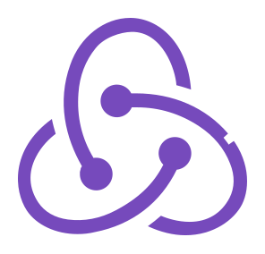
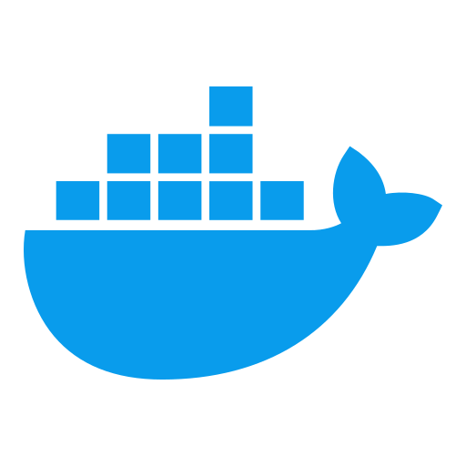
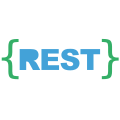

<!-- Header with animated typing effect -->
 

  

 
 
<!-- Professional Banner -->

  

<!--All Stack -->
## My favorite tools and technologies ⚙️

> Tools and technologies that I have worked with and am interested in
<table width="1008" style="table-layout: fixed; margin: 0 auto;">
  <!-- ===== Row 1 (Max 9 items) ===== -->
  <tr>
    <td align="center" width="112">
      
       TypeScript
    </td>
    <td align="center" width="112">
      
       Next.js
    </td>
    <td align="center" width="112">
      
       React
    </td>
    <td align="center" width="112">
      
       Redux
    </td>
    <td align="center" width="112">
      
       NestJS
    </td>
    <td align="center" width="112">
      
       Node.js
    </td>
    <td align="center" width="112">
      
       Socket.io
    </td>
    <td align="center" width="112">
      
       MongoDB
    </td>
    <td align="center" width="112">
      
       PostgreSQL
    </td>
  </tr>

  <!-- ===== Row 2 (Max 9 items) ===== -->
  <tr>
    <td align="center" width="112">
      
       Tailwind
    </td>
    <td align="center" width="112">
      
       Docker
    </td>
    <td align="center" width="112">
      
       MySQL
    </td>
    <td align="center" width="112">
      
       JavaScript
    </td>
    <td align="center" width="112">
      
       Express
    </td>
    <td align="center" width="112">
      
       Python
    </td>
    <td align="center" width="112">
      
       C++
    </td>
    <td align="center" width="112">
      
       Java
    </td>
    <td align="center" width="112">
      
       GitHub
    </td>
  </tr>

  <!-- ===== Row 3 (Remaining items) ===== -->
  <tr>
    <td align="center" width="112">
      
       Git
    </td>
    <td align="center" width="112">
      
       REST API
    </td>
    <td align="center" width="112">
      
       Prettier
    </td>
    <td align="center" width="112">
      
       Vite.js
    </td>
    <td align="center" width="112">
      
       HTML5
    </td>
    <td align="center" width="112">
      
       CSS3
    </td>
    <td align="center" width="112">
      
       VS Code
    </td>
    <td align="center" width="112"></td>
    <td align="center" width="112"></td>
  </tr>
</table>

<!-- Calendar -->
<table width="100%">
  <tr>
    <td colspan="2" align="center" width="1012">
      

        
Full year calendar

        
      

      

        
Half year calendar

        
      

      
    </td>
  </tr>
</table>

<!-- Footer Wave -->

  

<!-- Connect Me -->
## 📫 Let's Connect

I'm always open to connecting with developers and tech enthusiasts. Feel free to reach out to me through any of the platforms below!

<!-- Js Engin -->

